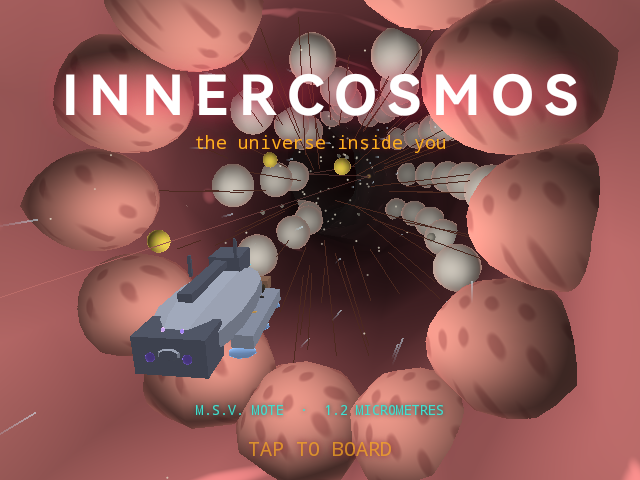
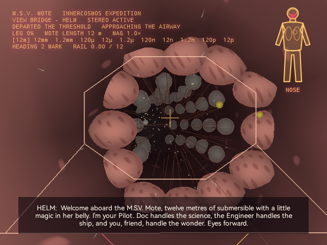

# InnerCosmos

InnerCosmos is a pair of stereoscopic rides through the human body for RayNeo X3 Pro AR glasses. Aboard the M.S.V. Mote, a fictional scale-drive submersible, the wearer travels a railed 3D tour narrated by a three-person crew: a fourteen-stop descent from a nostril down through the bloodstream, a neuron, and a membrane into the electron cloud of a single carbon atom, and a second tour that follows digestion, the liver, the kidney, and the immune system's V(D)J recombination up to a dividing cell. A third chapter follows the life of Norman Bethune, a Canadian thoracic surgeon and battlefield transfusion pioneer, told entirely through the tissues his work touched. Every figure the crew states is fact-checked and rounded honestly, the ambience and voice lines are procedurally synthesized, and the whole passage renders as continuous native OpenGL geometry rather than textured video.

## Screenshots

  
  

## Demo

## Controls

- Tap the right-arm touchpad to board, choose a tour, and select a starting depth
- Tap during a ride to cycle the camera view (Bridge, External, Scale Drive Core, Observation Deck)
- Double-tap to pause and reopen the depth menu
- Swipe forward to cycle the audio mix; swipe back to toggle the telemetry HUD
- Turn your head to look around; the glasses' IMU drives the view independently of the rail

## Download

[InnerCosmos.apk](InnerCosmos.apk)
